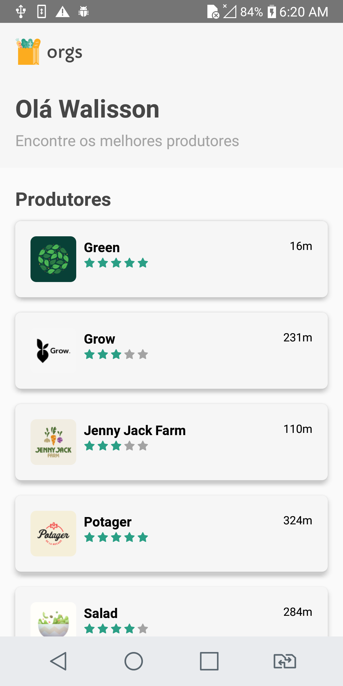
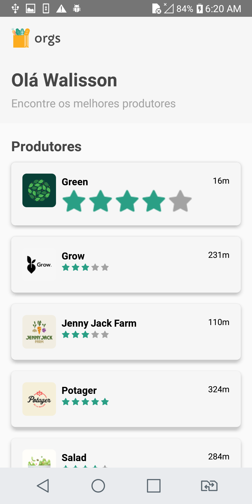
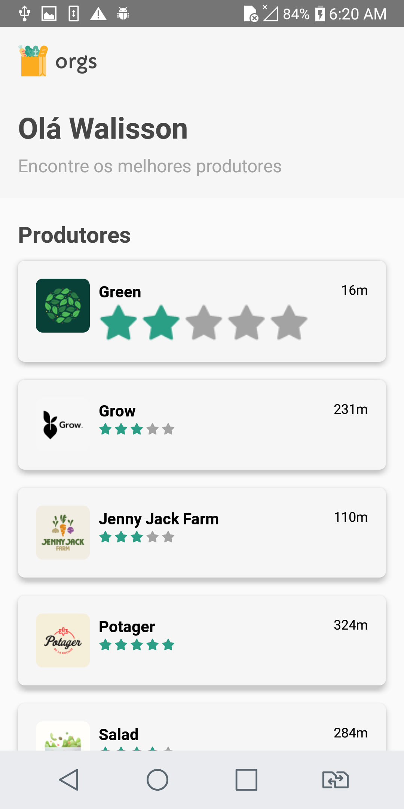

# orgs-avaliacao

##### Front-end E-commerce with React Native CLI - Producer rating
##### Mobile application to learn some important concepts of React Native

  

## How to install?

### On project's folder:

- yarn

```sh
yarn
```

- npm

```sh
npm install
```

## How to run?

- yarn

```sh
yarn start
```

- npm

```sh
npm start
```
